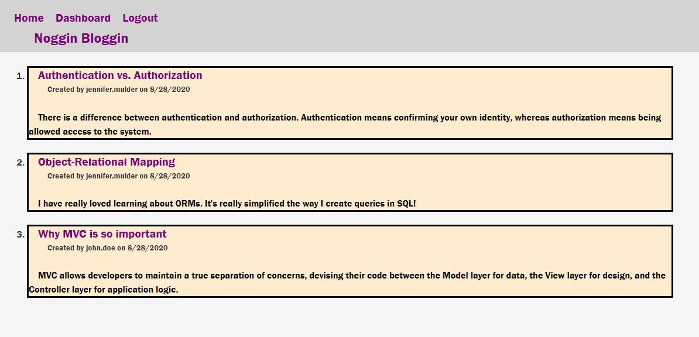

# just-tech-news

## Purpose
To provide the user with a CMS-style blog site where they can publish articles, blog posts, and thoughts/ opinions

## Features
When the user is not logged into the blog, they can see all of the interesting posts that other users have created. When the user creates a new user with their username, email, and password, they can then login to access more content. When logged in, the user can create new posts and edit them, as well as comment on the posts of other users. For whatever reason a post is no longer relevant, the use can easily delete their work with the click of a button.

## Built With
* JavaScript
* Node JS 
* Express
* MySQL
* Sequelize
* Dotenv

## API testing
Postman

## Usage
To run program: node server

## Website
https://serene-inlet-06032.herokuapp.com/

## Project Status
The CMS-style blog site is compliant with defined acceptance criteria

## Contribution
Created by Jennifer Mulder

